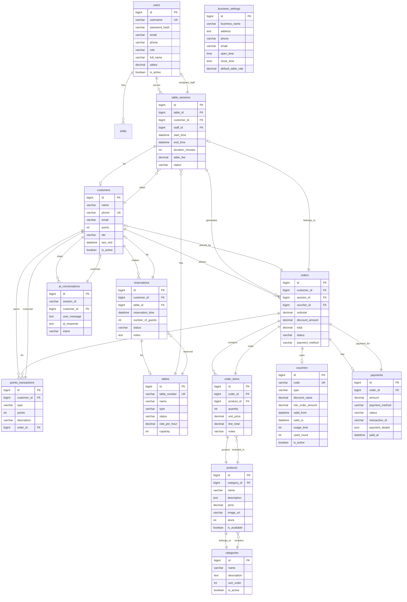

# USE CASE DIAGRAM

```mermaid
flowchart TB
    subgraph "HỆ THỐNG QUẢN LÝ BILLIARD CAFE"

        subgraph "🎱 QUẢN LÝ BÀN BIDA"
            UC1["Xem bàn trống"]
            UC2["Đặt bàn trước"]
            UC3["Check-in bàn"]
            UC4["Check-out bàn"]
            UC5["Cập nhật bàn"]
            UC6["Theo dõi thời gian chơi"]
            UC7["Hủy đặt bàn"]
        end

        subgraph "👥 QUẢN LÝ KHÁCH HÀNG"
            UC8["Đăng ký KH mới"]
            UC9["Tra cứu khách hàng"]
            UC10["Tích điểm"]
            UC11["Đổi điểm thưởng"]
            UC12["Xem lịch sử đặt/chơi"]
        end

        subgraph "🛒 GỌI MÓN & THANH TOÁN"
            UC13["Gọi món ăn/uống"]
            UC14["Cập nhật order"]
            UC15["Thanh toán"]
            UC16["Xuất hóa đơn"]
            UC17["Áp dụng khuyến mãi"]
            UC18["Thanh toán đa phương thức"]
            UC19["Xem menu"]
            UC20["Quản lý voucher"]
        end

        subgraph "🍽️ QUẢN LÝ MENU"
            UC21["Thêm món mới"]
            UC22["Sửa thông tin món"]
            UC23["Xóa món"]
            UC24["Quản lý danh mục"]
        end

        subgraph "📊 BÁO CÁO & THỐNG KÊ"
            UC25["Dashboard thống kê"]
            UC26["Báo cáo doanh thu"]
            UC27["Báo cáo tồn kho"]
            UC28["Báo cáo nhân viên"]
            UC29["Xuất báo cáo PDF/Excel"]
            UC30["Thống kê món bán chạy"]
        end

        subgraph "👔 QUẢN LÝ NHÂN VIÊN"
            UC31["Thêm nhân viên"]
            UC32["Phân ca làm việc"]
            UC33["Chấm công"]
            UC34["Tính lương"]
        end

        subgraph "🤖 AI SERVICES"
            UC35["Chat tư vấn AI"]
            UC36["Kiểm tra bàn trống AI"]
            UC37["Gợi ý bàn AI"]
            UC38["Gợi ý món AI"]
            UC39["AI Insights"]
            UC40["AI dự đoán xu hướng"]
            UC41["AI trả lời tự động"]
        end

        subgraph "⚙️ CÀI ĐẶT"
            UC42["Cấu hình giá thuê bàn"]
            UC43["Cấu hình giờ mở cửa"]
            UC44["Quản lý tài khoản"]
            UC45["Sao lưu dữ liệu"]
        end

        UC_LOGIN{{"Đăng nhập"}}
    end

    %% ACTORS
    ADMIN["👤 Quản trị viên"]
    STAFF["👤 Nhân viên"]
    CUSTOMER["👤 Khách hàng"]
    AI_BOT["🤖 AI Chatbot"]

    %% ADMIN CONNECTIONS
    ADMIN --> UC_LOGIN
    ADMIN --> UC1 & UC2 & UC3 & UC4 & UC5
    ADMIN --> UC8 & UC9 & UC10 & UC11
    ADMIN --> UC13 & UC14 & UC15 & UC16 & UC17 & UC18 & UC19 & UC20
    ADMIN --> UC21 & UC22 & UC23 & UC24
    ADMIN --> UC25 & UC26 & UC27 & UC28 & UC29 & UC30
    ADMIN --> UC31 & UC32 & UC33 & UC34
    ADMIN --> UC35 & UC36 & UC37 & UC38 & UC39 & UC40 & UC41
    ADMIN --> UC42 & UC43 & UC44 & UC45

    %% STAFF CONNECTIONS
    STAFF --> UC_LOGIN
    STAFF --> UC1 & UC3 & UC4
    STAFF --> UC8 & UC9
    STAFF --> UC13 & UC14 & UC15 & UC16
    STAFF --> UC33

    %% CUSTOMER CONNECTIONS
    CUSTOMER --> UC1 & UC2 & UC6
    CUSTOMER --> UC10 & UC11 & UC12
    CUSTOMER --> UC19
    CUSTOMER --> UC35 & UC36 & UC37 & UC38

    %% AI BOT CONNECTIONS
    AI_BOT --> UC35 & UC36 & UC41

    %% STYLES
    style ADMIN fill:#5C6BC0,stroke:#3949AB,color:#fff
    style STAFF fill:#66BB6A,stroke:#43A047,color:#fff
    style CUSTOMER fill:#FFA726,stroke:#FB8C00,color:#fff
    style AI_BOT fill:#AB47BC,stroke:#8E24AA,color:#fff
    style UC_LOGIN fill:#FFEBEE,stroke:#D32F2F,stroke-width:3
    style UC1 fill:#FFF8E1,stroke:#FFB300
    style UC2 fill:#E3F2FD,stroke:#1976D2
    style UC3 fill:#E8F5E9,stroke:#388E3C
    style UC4 fill:#E8F5E9,stroke:#388E3C
    style UC35 fill:#F3E5F5,stroke:#8E24AA,stroke-width:2
    style UC36 fill:#F3E5F5,stroke:#8E24AA,stroke-width:2
    style UC37 fill:#F3E5F5,stroke:#8E24AA,stroke-width:2
    style UC38 fill:#F3E5F5,stroke:#8E24AA,stroke-width:2
```



---

# ERD DIAGRAM



---

# CÁCH XEM TRỰC TIẾP

## Cách 1: VS Code (Khuyến nghị)
1. Cài extension **"Markdown Preview Mermaid"**
2. Mở file `.md` này
3. Nhấn **Ctrl+Shift+P** → **Markdown: Open Preview**

## Cách 2: GitHub/GitLab
- Paste nội dung này vào `README.md`
- Markdown sẽ tự render Mermaid diagrams

## Cách 3: Online
- Truy cập https://mermaid.live
- Paste code Mermaid và xem ngay

## Cách 4: Discord/Slack
- Cài Mermaid bot
- Dùng syntax:
  ````
  ```mermaid
  [code here]
  ```
  ````

---

# BẢNG TÓM TẮT USE CASES

| STT | Tên Use Case | Actor | Mô tả |
|-----|--------------|-------|--------|
| 1 | Xem bàn trống | Admin, Staff, Customer | Xem danh sách bàn đang trống |
| 2 | Đặt bàn trước | Admin, Customer | Đặt trước bàn theo ngày giờ |
| 3 | Check-in bàn | Admin, Staff | Bắt đầu phiên chơi |
| 4 | Check-out bàn | Admin, Staff | Kết thúc phiên chơi |
| 5 | Cập nhật bàn | Admin | Thêm/sửa/xóa thông tin bàn |
| 6 | Theo dõi thời gian | Customer, Staff | Đếm thời gian chơi |
| 7 | Hủy đặt bàn | Customer | Hủy reservation |
| 8 | Đăng ký KH mới | Admin, Staff | Tạo tài khoản khách hàng |
| 9 | Tra cứu KH | Admin, Staff | Tìm kiếm thông tin KH |
| 10 | Tích điểm | Customer | Cộng điểm sau mua hàng |
| 11 | Đổi điểm thưởng | Customer | Dùng điểm đổi quà/voucher |
| 12 | Xem lịch sử | Customer | Xem lịch sử đặt bàn/chơi |
| 13 | Gọi món | Admin, Staff, Customer | Thêm món vào order |
| 14 | Cập nhật order | Admin, Staff | Thêm/sửa/xóa món |
| 15 | Thanh toán | Admin, Staff, Customer | Thanh toán hóa đơn |
| 16 | Xuất hóa đơn | Admin, Staff | In/xuất hóa đơn |
| 17 | Áp dụng KM | Customer | Dùng voucher giảm giá |
| 18 | TT đa phương thức | Admin, Staff | Cash, bank, MoMo, ZaloPay |
| 19 | Xem menu | Customer | Xem danh sách món |
| 20 | Quản lý voucher | Admin | Tạo/sửa voucher |
| 21 | Thêm món mới | Admin | Thêm sản phẩm vào menu |
| 22 | Sửa món | Admin | Cập nhật thông tin món |
| 23 | Xóa món | Admin | Xóa món khỏi menu |
| 24 | Quản lý danh mục | Admin | Thêm/sửa danh mục |
| 25 | Dashboard | Admin | Thống kê trực quan |
| 26 | Báo cáo DT | Admin | Báo cáo doanh thu |
| 27 | Báo cáo tồn kho | Admin | Kiểm tra hàng tồn |
| 28 | Báo cáo NV | Admin | Thống kê nhân viên |
| 29 | Xuất báo cáo | Admin | Export PDF/Excel |
| 30 | Món bán chạy | Admin | Top sản phẩm bán chạy |
| 31 | Thêm nhân viên | Admin | Thêm tài khoản nhân viên |
| 32 | Phân ca | Admin | Sắp xếp ca làm việc |
| 33 | Chấm công | Staff | Check in/out ca làm |
| 34 | Tính lương | Admin | Tính lương theo ca |
| 35 | Chat tư vấn AI | Customer | Chat với AI chatbot |
| 36 | Kiểm tra bàn AI | Customer | AI kiểm tra bàn trống |
| 37 | Gợi ý bàn AI | Customer | AI đề xuất bàn phù hợp |
| 38 | Gợi ý món AI | Customer | AI gợi ý món ăn/uống |
| 39 | AI Insights | Admin | AI phân tích dữ liệu |
| 40 | AI dự đoán | Admin | AI dự đoán xu hướng |
| 41 | AI trả lời tự động | AI Bot | Auto-reply tin nhắn |
| 42 | Cấu hình giá | Admin | Thiết lập giá thuê bàn |
| 43 | Cấu hình giờ | Admin | Đặt giờ mở/đóng cửa |
| 44 | Quản lý tài khoản | Admin | Phân quyền người dùng |
| 45 | Sao lưu dữ liệu | Admin | Backup dữ liệu hệ thống |

---

# BẢNG TÓM TẮT ENTITIES (ERD)

| STT | Tên Bảng | Khóa chính | Khóa ngoại | Mô tả |
|-----|----------|------------|------------|--------|
| 1 | users | id | - | Tài khoản người dùng |
| 2 | customers | id | - | Thông tin khách hàng |
| 3 | tables | id | - | Thông tin bàn bida |
| 4 | table_sessions | id | table_id, customer_id, staff_id | Phiên chơi |
| 5 | reservations | id | customer_id, table_id | Đặt bàn |
| 6 | categories | id | - | Danh mục sản phẩm |
| 7 | products | id | category_id | Sản phẩm/món |
| 8 | orders | id | customer_id, session_id, voucher_id | Hóa đơn |
| 9 | order_items | id | order_id, product_id | Chi tiết hóa đơn |
| 10 | vouchers | id | - | Mã khuyến mãi |
| 11 | payments | id | order_id | Thông tin thanh toán |
| 12 | shifts | id | staff_id | Ca làm việc |
| 13 | points_transactions | id | customer_id, order_id | Lịch sử điểm |
| 14 | ai_conversations | id | customer_id | Lịch sử chat AI |
| 15 | business_settings | id | - | Cấu hình hệ thống |
