# Mermaid Diagrams - Billiard Cafe AI System
# Copy and paste các diagram vào: https://mermaid.live hoặc draw.io

# ==========================================
# 1. ARCHITECTURE DIAGRAM
# ==========================================

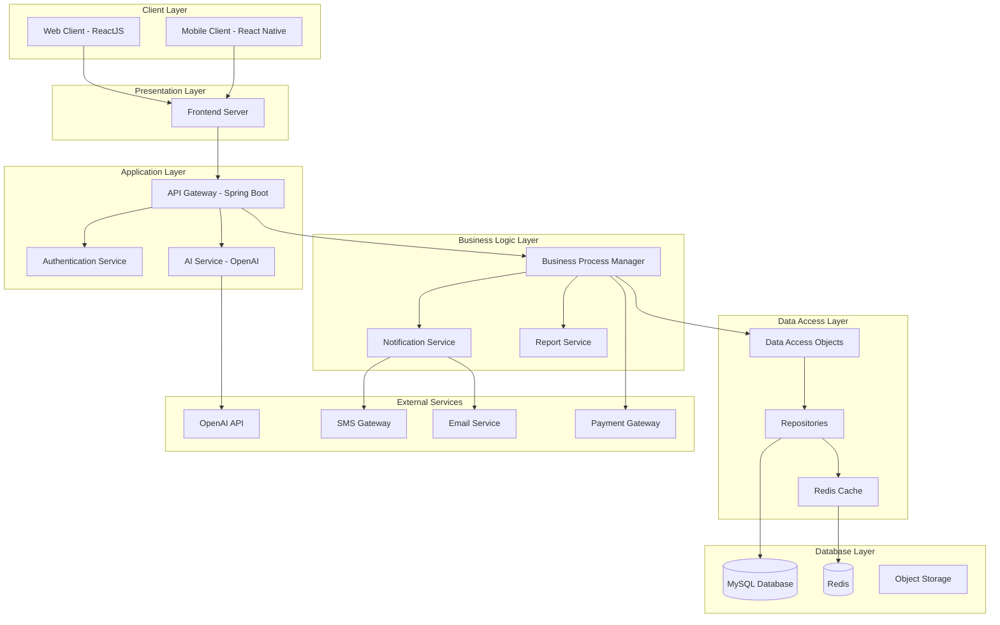

# ==========================================
# 2. USE CASE DIAGRAM
# ==========================================

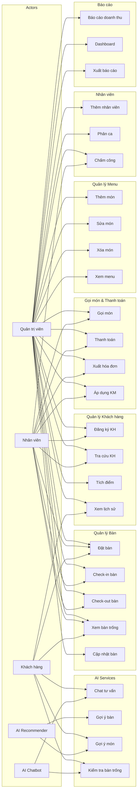

# ==========================================
# 3. ACTIVITY DIAGRAM - Quy trình Check-in/Check-out
# ==========================================

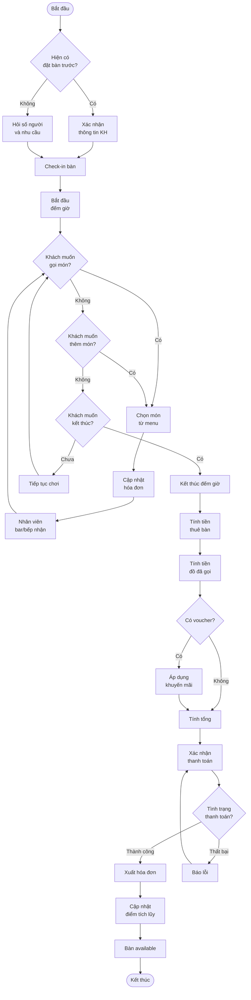

# ==========================================
# 4. SEQUENCE DIAGRAM - Đặt bàn với AI
# ==========================================

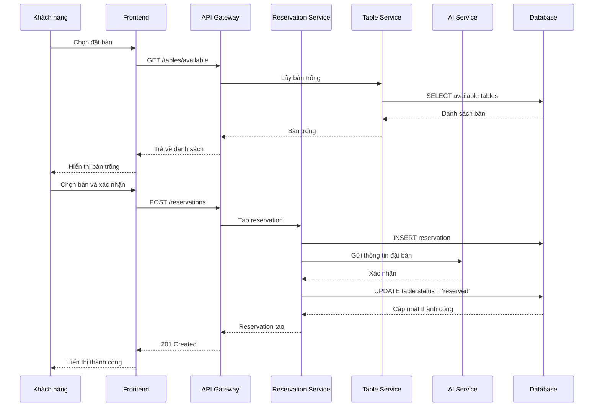

# ==========================================
# 5. SEQUENCE DIAGRAM - AI Chatbot
# ==========================================

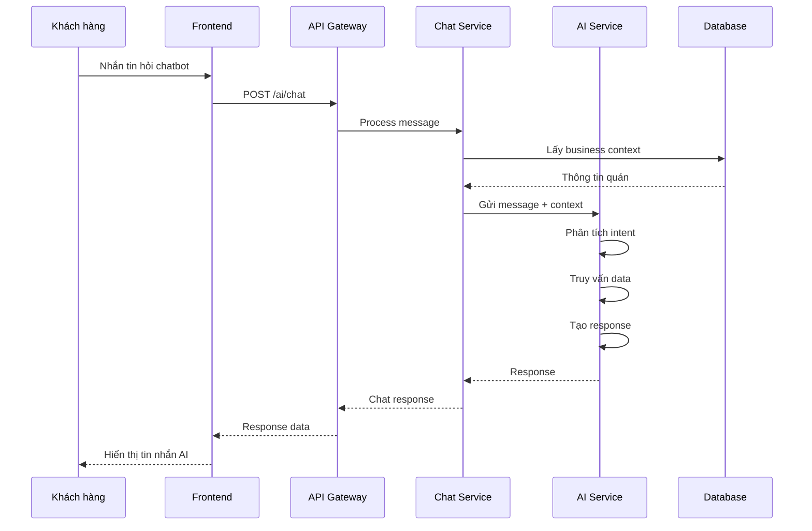

# ==========================================
# 6. CLASS DIAGRAM
# ==========================================

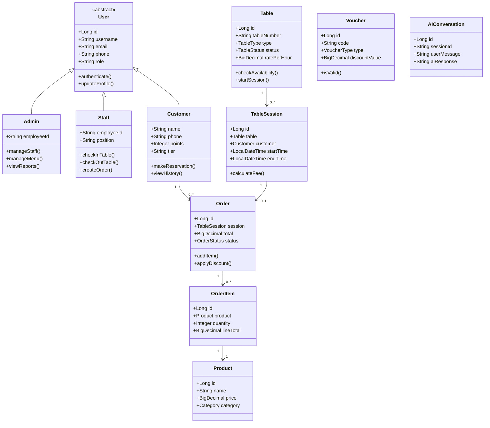

# ==========================================
# 7. ERD DIAGRAM
# ==========================================

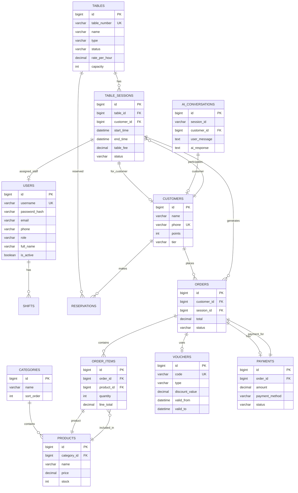

# ==========================================
# 8. COMPONENT DIAGRAM
# ==========================================

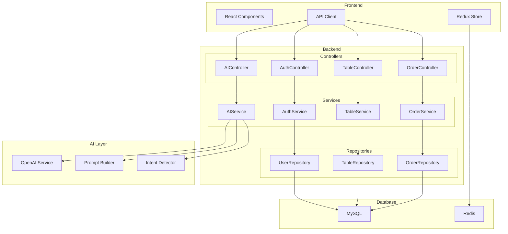

# ==========================================
# 9. DEPLOYMENT DIAGRAM
# ==========================================

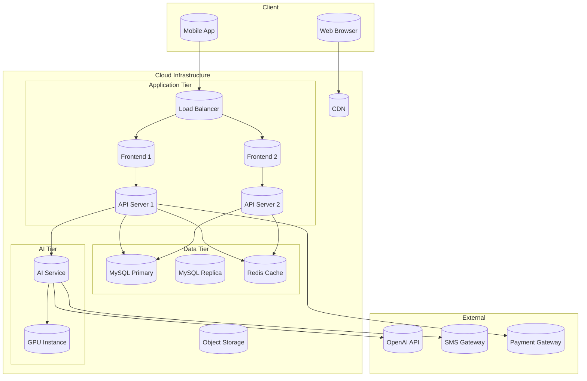

# ==========================================
# 10. AI WORKFLOW DIAGRAM
# ==========================================

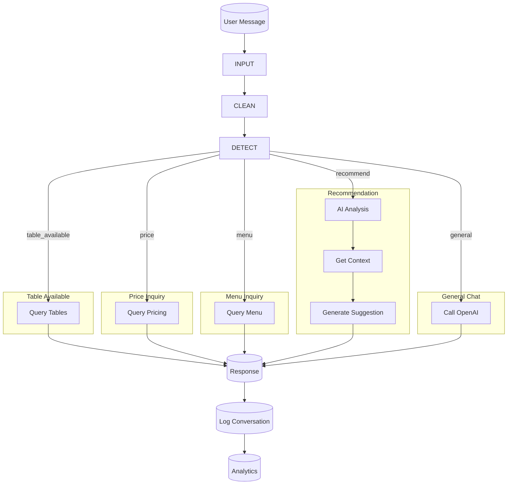

# ==========================================
# 11. AI RECOMMENDATION DIAGRAM
# ==========================================

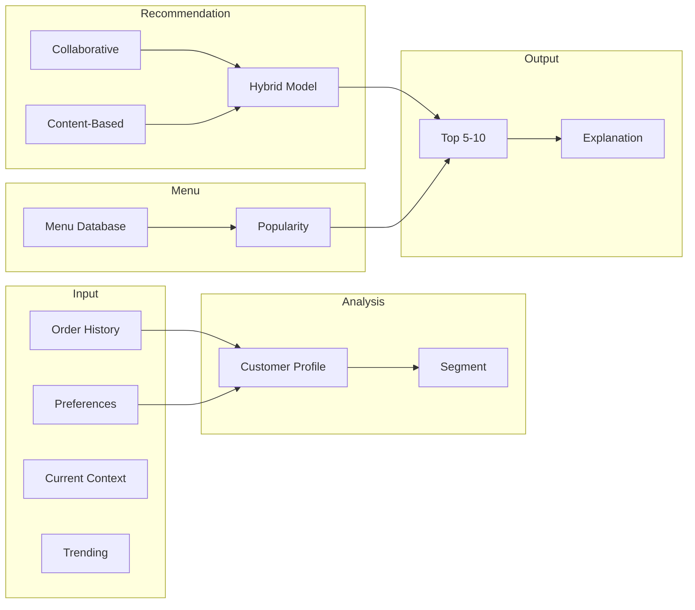

# ==========================================
# 12. STATE DIAGRAM - Table Status
# ==========================================

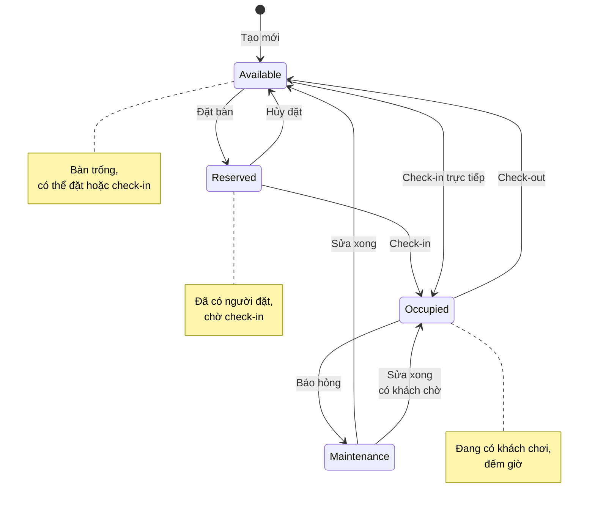

# ==========================================
# 13. STATE DIAGRAM - Order Status
# ==========================================

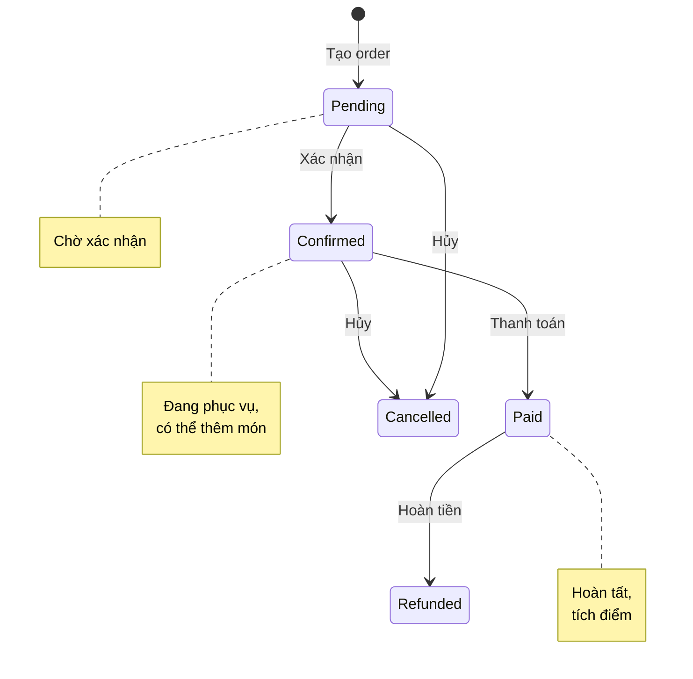

# ==========================================
# CÁCH SỬ DỤNG
# ==========================================

Hướng dẫn sử dụng các diagram:

1. **Mermaid Live Editor**: https://mermaid.live
   - Paste code vào editor bên trái
   - Xem preview bên phải
   - Export as PNG/SVG

2. **draw.io (diagrams.net)**:
   - Insert > Advanced > Mermaid
   - Paste code
   - OK

3. **VS Code**:
   - Cài extension "Mermaid Markdown Syntax Highlighting"
   - Preview Markdown với Mermaid

4. **Lucidchart**:
   - Import > Mermaid
   - Paste code

5. **PlantUML**:
   - Cần cài Java và Graphviz
   - Sử dụng plugin cho IDE
