# HỆ THỐNG QUẢN LÝ BILLIARD CAFE TÍCH HỢP AI
## Tài liệu Phân tích và Thiết kế Hệ thống (SAD)
### Theo chuẩn UML 2.0

---

## MỤC LỤC
1. Architecture Diagram
2. Use Case Diagram
3. Use Case Specification
4. Activity Diagram
5. Sequence Diagram
6. Class Diagram
7. ERD Diagram
8. Database Schema
9. Component Diagram
10. Deployment Diagram
11. AI Workflow Diagram
12. AI Recommendation Diagram

---

## 1. ARCHITECTURE DIAGRAM

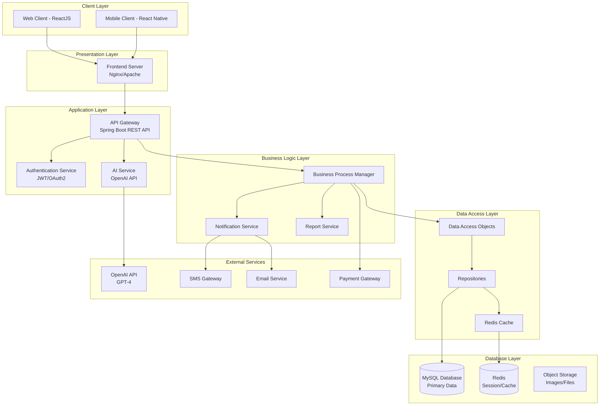

---

## 2. USE CASE DIAGRAM

```mermaid
graph LR
    subgraph "Actors"
        ADMIN[👤 Quản trị viên]
        STAFF[👤 Nhân viên]
        CUSTOMER[👤 Khách hàng]
        AI_CHATBOT[🤖 AI Chatbot]
        AI_RECOMMENDER[🤖 AI Recommender]
    end

    subgraph "Quản lý Bàn"
        UC1[("📋 Đặt bàn")]
        UC2[("📋 Check-in bàn")]
        UC3[("📋 Check-out bàn")]
        UC4[("📋 Xem bàn trống")]
        UC5[("📋 Cập nhật bàn")]
    end

    subgraph "Quản lý Khách hàng"
        UC6[("👥 Đăng ký KH")]
        UC7[("👥 Tra cứu KH")]
        UC8[("👥 Tích điểm")]
        UC9[("👥 Xem lịch sử")]
    end

    subgraph "Gọi món & Thanh toán"
        UC10[("🛒 Gọi món")]
        UC11[("💳 Thanh toán")]
        UC12[("🧾 Xuất hóa đơn")]
        UC13[("🎫 Áp dụng KM")]
    end

    subgraph "Quản lý Menu"
        UC14[("🍽️ Thêm món")]
        UC15[("🍽️ Sửa món")]
        UC16[("🍽️ Xóa món")]
        UC17[("🍽️ Xem menu")]
    end

    subgraph "Báo cáo & Thống kê"
        UC18[("📊 Báo cáo doanh thu")]
        UC19[("📊 Dashboard")]
        UC20[("📊 Xuất báo cáo")]
    end

    subgraph "AI Services"
        UC21[("🤖 Chat tư vấn")]
        UC22[("🤖 Gợi ý bàn")]
        UC23[("🤖 Gợi ý món")]
        UC24[("🤖 Kiểm tra bàn trống")]
    end

    subgraph "Quản lý Nhân viên"
        UC25[("👔 Thêm nhân viên")]
        UC26[("👔 Phân ca")]
        UC27[("👔 Chấm công")]
    end

    ADMIN --> UC1
    ADMIN --> UC2
    ADMIN --> UC3
    ADMIN --> UC4
    ADMIN --> UC5
    ADMIN --> UC6
    ADMIN --> UC7
    ADMIN --> UC8
    ADMIN --> UC9
    ADMIN --> UC10
    ADMIN --> UC11
    ADMIN --> UC12
    ADMIN --> UC13
    ADMIN --> UC14
    ADMIN --> UC15
    ADMIN --> UC16
    ADMIN --> UC17
    ADMIN --> UC18
    ADMIN --> UC19
    ADMIN --> UC20
    ADMIN --> UC25
    ADMIN --> UC26
    ADMIN --> UC27

    STAFF --> UC1
    STAFF --> UC2
    STAFF --> UC3
    STAFF --> UC4
    STAFF --> UC10
    STAFF --> UC11
    STAFF --> UC12
    STAFF --> UC13
    STAFF --> UC6
    STAFF --> UC7
    STAFF --> UC27

    CUSTOMER --> UC1
    CUSTOMER --> UC4
    CUSTOMER --> UC24
    CUSTOMER --> UC21
    CUSTOMER --> UC23
    CUSTOMER --> UC9

    AI_CHATBOT --> UC21
    AI_CHATBOT --> UC24
    AI_RECOMMENDER --> UC22
    AI_RECOMMENDER --> UC23
```

---

## 3. USE CASE SPECIFICATION

### UC1: Đặt bàn

| Thuộc tính | Mô tả |
|------------|-------|
| **UC ID** | UC-001 |
| **Tên** | Đặt bàn (Table Reservation) |
| **Actor** | Khách hàng, Nhân viên, Quản trị viên |
| **Mô tả** | Cho phép khách hàng đặt trước bàn bida theo ngày giờ và số người |
| **Pre-condition** | Khách hàng đã đăng nhập hoặc cung cấp thông tin liên hệ |
| **Post-condition** | Bàn được đánh dấu "reserved", thông báo gửi đến khách hàng |

**Flow chính:**
1. Khách hàng chọn ngày giờ mong muốn
2. Hệ thống hiển thị các bàn trống
3. Khách hàng chọn bàn và số người
4. Khách hàng xác nhận thông tin đặt bàn
5. Hệ thống lưu thông tin và gửi xác nhận
6. Bàn được cập nhật trạng thái thành "reserved"

---

### UC2: Check-in bàn

| Thuộc tính | Mô tả |
|------------|-------|
| **UC ID** | UC-002 |
| **Tên** | Check-in bàn (Table Check-in) |
| **Actor** | Nhân viên, Quản trị viên |
| **Mô tả** | Bắt đầu phiên chơi khi khách hàng đến quán |
| **Pre-condition** | Bàn đang ở trạng thái "available" hoặc "reserved" |
| **Post-condition** | Bàn chuyển sang trạng thái "occupied", timer bắt đầu |

**Flow chính:**
1. Nhân viên chọn bàn cần check-in
2. Hệ thống hiển thị thông tin khách hàng (nếu đã đặt trước)
3. Nhân viên nhập thông tin khách hàng (nếu chưa có)
4. Nhân viên xác nhận check-in
5. Hệ thống bắt đầu đếm thời gian chơi
6. Bàn chuyển sang trạng thái "occupied"

---

### UC3: Check-out bàn

| Thuộc tính | Mô tả |
|------------|-------|
| **UC ID** | UC-003 |
| **Tên** | Check-out bàn (Table Check-out) |
| **Actor** | Nhân viên, Quản trị viên |
| **Mô tả** | Kết thúc phiên chơi và tính tiền |
| **Pre-condition** | Bàn đang ở trạng thái "occupied" |
| **Post-condition** | Bàn chuyển sang "available", hóa đơn được tạo |

**Flow chính:**
1. Nhân viên chọn bàn cần check-out
2. Hệ thống hiển thị thời gian chơi và tiền thuê bàn
3. Hệ thống hiển thị các món đã gọi
4. Nhân viên kiểm tra và xác nhận
5. Hệ thống tính tổng tiền
6. Khách hàng thanh toán
7. Bàn chuyển sang trạng thái "available"

---

### UC4: Xem bàn trống

| Thuộc tính | Mô tả |
|------------|-------|
| **UC ID** | UC-004 |
| **Tên** | Xem bàn trống (View Available Tables) |
| **Actor** | Khách hàng, Nhân viên, AI Chatbot |
| **Mô tả** | Hiển thị danh sách các bàn đang trống |
| **Pre-condition** | Không có |
| **Post-condition** | Hiển thị danh sách bàn trống với thông tin chi tiết |

**Flow chính:**
1. Người dùng yêu cầu xem bàn trống
2. Hệ thống truy vấn các bàn có trạng thái "available" hoặc "empty"
3. Hệ thống trả về danh sách kèm thông tin (số bàn, loại, giá)

---

### UC10: Gọi món

| Thuộc tính | Mô tả |
|------------|-------|
| **UC ID** | UC-010 |
| **Tên** | Gọi món (Order Items) |
| **Actor** | Nhân viên, Khách hàng |
| **Mô tả** | Thêm đồ ăn, đồ uống vào hóa đơn của bàn |
| **Pre-condition** | Bàn đang ở trạng thái "occupied" |
| **Post-condition** | Order item được thêm vào hóa đơn |

**Flow chính:**
1. Chọn bàn đang chơi
2. Chọn món từ menu
3. Nhập số lượng
4. Xác nhận thêm món
5. Hệ thống cập nhật hóa đơn
6. Thông báo đến nhân viên bar/bếp

---

### UC11: Thanh toán

| Thuộc tính | Mô tả |
|------------|-------|
| **UC ID** | UC-011 |
| **Tên** | Thanh toán (Payment) |
| **Actor** | Nhân viên, Khách hàng |
| **Mô tả** | Thanh toán hóa đơn bằng tiền mặt hoặc chuyển khoản |
| **Pre-condition** | Có hóa đơn cần thanh toán |
| **Post-condition** | Hóa đơn được đánh dấu "paid" |

**Flow chính:**
1. Chọn hóa đơn cần thanh toán
2. Hệ thống tính tổng tiền (thuê bàn + đồ đã gọi - khuyến mãi)
3. Khách hàng chọn phương thức thanh toán
4. Xác nhận thanh toán
5. Hệ thống xuất hóa đơn
6. Cập nhật điểm tích lũy (nếu có)

---

### UC21: Chat tư vấn AI

| Thuộc tính | Mô tả |
|------------|-------|
| **UC ID** | UC-021 |
| **Tên** | Chat tư vấn AI (AI Chat Consultation) |
| **Actor** | Khách hàng, AI Chatbot |
| **Mô tả** | AI chatbot tư vấn thông tin về bàn, giá, menu, địa chỉ |
| **Pre-condition** | Khách hàng mở chatbot |
| **Post-condition** | Khách hàng nhận được thông tin tư vấn |

**Flow chính:**
1. Khách hàng nhắn tin hỏi chatbot
2. Hệ thống gửi request đến AI Service
3. AI Service gọi OpenAI API với context
4. AI trả lời dựa trên thông tin quán
5. Hệ thống hiển thị câu trả lời

---

### UC22: Gợi ý bàn AI

| Thuộc tính | Mô tả |
|------------|-------|
| **UC ID** | UC-022 |
| **Tên** | Gợi ý bàn AI (AI Table Recommendation) |
| **Actor** | AI Recommender, Khách hàng |
| **Mô tả** | AI phân tích và gợi ý bàn phù hợp với nhu cầu khách |
| **Pre-condition** | Khách hàng cần tư vấn về bàn |
| **Post-condition** | Khách hàng nhận được gợi ý bàn cụ thể |

**Flow chính:**
1. Khách hàng hỏi về đặt bàn/gợi ý bàn
2. AI phân tích yêu cầu (số người, loại bàn, thời gian)
3. AI truy vấn database lấy thông tin bàn
4. AI đề xuất bàn phù hợp nhất
5. Trả về thông tin bàn và cách đặt

---

### UC23: Gợi ý món AI

| Thuộc tính | Mô tả |
|------------|-------|
| **UC ID** | UC-023 |
| **Tên** | Gợi ý món AI (AI Food Recommendation) |
| **Actor** | AI Recommender, Khách hàng |
| **Mô tả** | AI gợi ý món ăn, đồ uống dựa trên sở thích khách |
| **Pre-condition** | Có thông tin về sở thích khách hàng hoặc món đã gọi |
| **Post-condition** | Khách hàng nhận được gợi ý món phù hợp |

**Flow chính:**
1. Hệ thống thu thập thông tin (món đã gọi, lịch sử order)
2. AI phân tích patterns và sở thích
3. AI truy vấn menu và món bán chạy
4. AI đề xuất các món phù hợp
5. Trả về gợi ý có giá và mô tả

---

## 4. ACTIVITY DIAGRAM

### 4.1 Activity: Quy trình đặt và chơi bàn

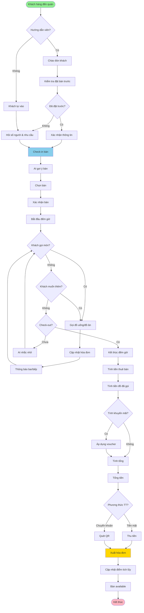

### 4.2 Activity: AI Chatbot tư vấn

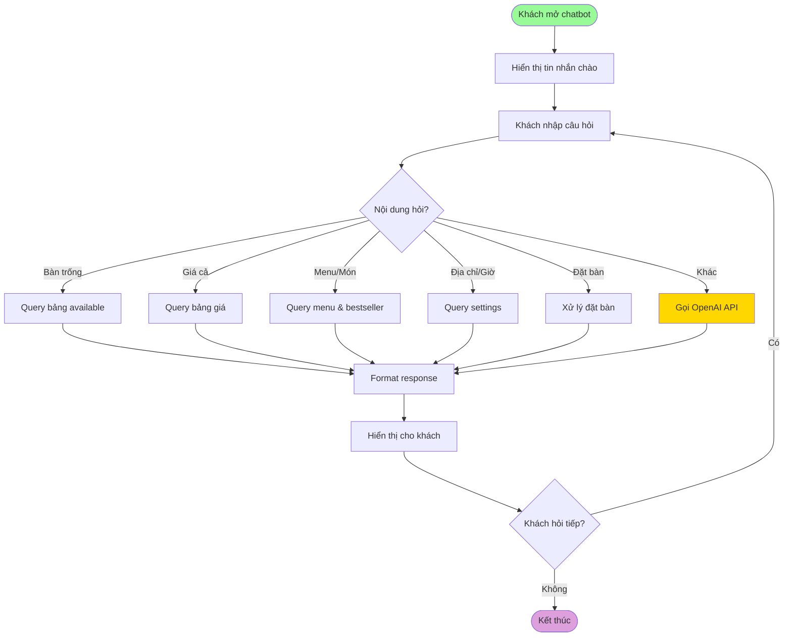

---

## 5. SEQUENCE DIAGRAM

### 5.1 Sequence: Đặt bàn

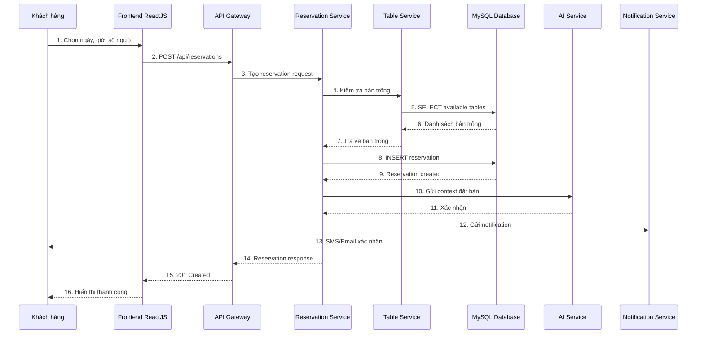

### 5.2 Sequence: Thanh toán với AI gợi ý

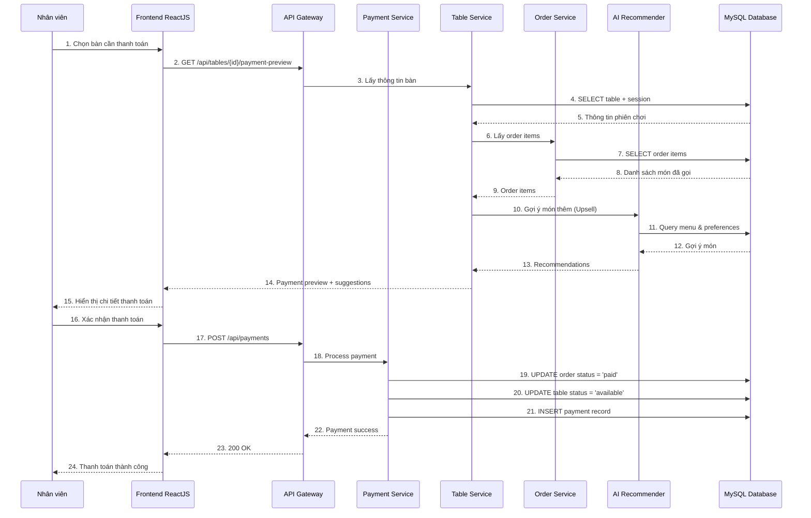

### 5.3 Sequence: AI Chatbot

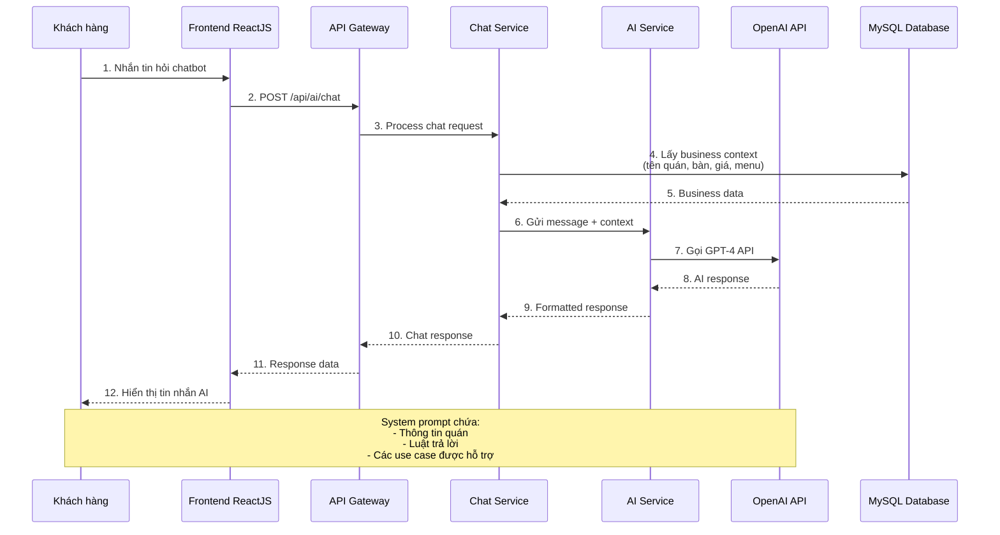

---

## 6. CLASS DIAGRAM

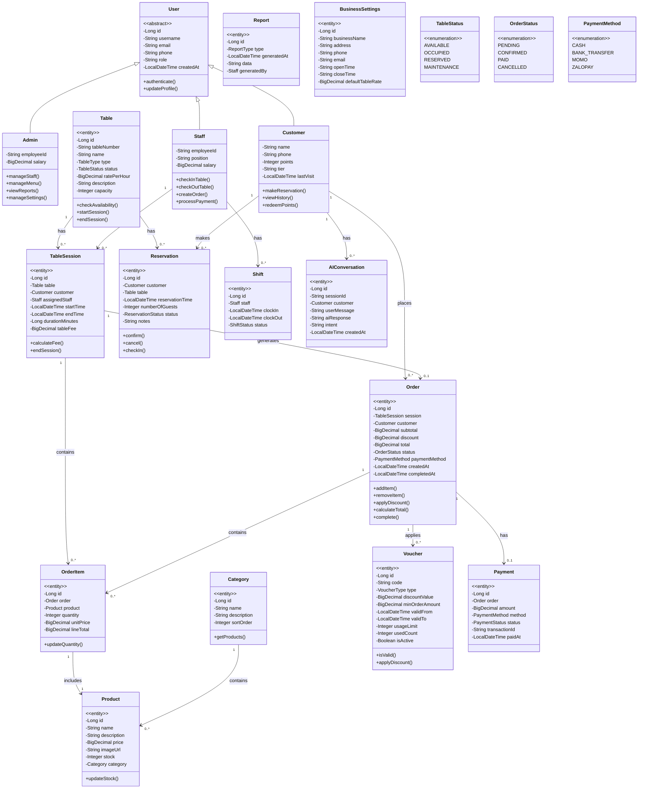

---

## 7. ERD DIAGRAM

```mermaid
erDiagram
    USERS ||--o{ SHIFTS : has
    USERS {
        bigint id PK
        varchar username UK
        varchar password_hash
        varchar email
        varchar phone
        varchar role
        varchar full_name
        decimal salary
        boolean is_active
        timestamp created_at
        timestamp updated_at
    }

    SHIFTS ||--|| USERS : belongs_to
    SHIFTS {
        bigint id PK
        bigint staff_id FK
        datetime clock_in
        datetime clock_out
        varchar status
        timestamp created_at
    }

    TABLES ||--o{ TABLE_SESSIONS : has
    TABLES ||--o{ RESERVATIONS : reserved
    TABLES {
        bigint id PK
        varchar table_number UK
        varchar name
        varchar type
        varchar status
        decimal rate_per_hour
        varchar description
        int capacity
        timestamp created_at
        timestamp updated_at
    }

    CUSTOMERS ||--o{ RESERVATIONS : makes
    CUSTOMERS ||--o{ ORDERS : places
    CUSTOMERS ||--o{ TABLE_SESSIONS : participates
    CUSTOMERS ||--o{ POINTS_TRANSACTIONS : has
    CUSTOMERS {
        bigint id PK
        varchar name
        varchar phone UK
        varchar email
        int points
        varchar tier
        datetime last_visit
        boolean is_active
        timestamp created_at
    }

    TABLE_SESSIONS ||--|| TABLES : belongs_to
    TABLE_SESSIONS ||--o| CUSTOMERS : for_customer
    TABLE_SESSIONS ||--o| USERS : assigned_staff
    TABLE_SESSIONS ||--o{ ORDERS : generates
    TABLE_SESSIONS {
        bigint id PK
        bigint table_id FK
        bigint customer_id FK
        bigint staff_id FK
        datetime start_time
        datetime end_time
        int duration_minutes
        decimal table_fee
        varchar status
        timestamp created_at
    }

    RESERVATIONS ||--|| TABLES : for_table
    RESERVATIONS ||--o| CUSTOMERS : by_customer
    RESERVATIONS {
        bigint id PK
        bigint customer_id FK
        bigint table_id FK
        datetime reservation_time
        int number_of_guests
        varchar status
        text notes
        timestamp created_at
        timestamp updated_at
    }

    CATEGORIES ||--o{ PRODUCTS : contains
    CATEGORIES {
        bigint id PK
        varchar name
        text description
        int sort_order
        boolean is_active
        timestamp created_at
    }

    PRODUCTS ||--o{ ORDER_ITEMS : included_in
    PRODUCTS ||--|| CATEGORIES : belongs_to
    PRODUCTS {
        bigint id PK
        bigint category_id FK
        varchar name
        text description
        decimal price
        varchar image_url
        int stock
        boolean is_available
        timestamp created_at
        timestamp updated_at
    }

    ORDERS ||--o| CUSTOMERS : placed_by
    ORDERS ||--o| TABLE_SESSIONS : belongs_to
    ORDERS ||--o| VOUCHERS : uses
    ORDERS ||--o| PAYMENTS : has
    ORDERS ||--o{ ORDER_ITEMS : contains
    ORDERS {
        bigint id PK
        bigint customer_id FK
        bigint session_id FK
        bigint voucher_id FK
        decimal subtotal
        decimal discount_amount
        decimal total
        varchar status
        varchar payment_method
        datetime created_at
        datetime completed_at
    }

    ORDER_ITEMS ||--|| PRODUCTS : product
    ORDER_ITEMS ||--|| ORDERS : order
    ORDER_ITEMS {
        bigint id PK
        bigint order_id FK
        bigint product_id FK
        int quantity
        decimal unit_price
        decimal line_total
        varchar notes
    }

    VOUCHERS {
        bigint id PK
        varchar code UK
        varchar type
        decimal discount_value
        decimal min_order_amount
        datetime valid_from
        datetime valid_to
        int usage_limit
        int used_count
        boolean is_active
        timestamp created_at
    }

    PAYMENTS ||--|| ORDERS : payment_for
    PAYMENTS {
        bigint id PK
        bigint order_id FK
        decimal amount
        varchar payment_method
        varchar status
        varchar transaction_id
        text payment_details
        datetime paid_at
        timestamp created_at
    }

    POINTS_TRANSACTIONS ||--|| CUSTOMERS : customer
    POINTS_TRANSACTIONS {
        bigint id PK
        bigint customer_id FK
        varchar type
        int points
        varchar description
        bigint order_id FK
        timestamp created_at
    }

    AI_CONVERSATIONS ||--o| CUSTOMERS : customer
    AI_CONVERSATIONS {
        bigint id PK
        varchar session_id
        bigint customer_id FK
        text user_message
        text ai_response
        varchar intent
        timestamp created_at
    }

    BUSINESS_SETTINGS {
        bigint id PK
        varchar business_name
        text address
        varchar phone
        varchar email
        varchar open_time
        varchar close_time
        decimal default_table_rate
        varchar logo_url
        text terms_conditions
        timestamp updated_at
    }
```

---

## 8. DATABASE SCHEMA (MySQL)

```sql
-- ============================================
-- BILLIARD CAFE MANAGEMENT SYSTEM
-- Database Schema for MySQL
-- ============================================

CREATE DATABASE IF NOT EXISTS billiard_cafe
CHARACTER SET utf8mb4
COLLATE utf8mb4_unicode_ci;

USE billiard_cafe;

-- ============================================
-- TABLE: users (Staff & Admin)
-- ============================================
CREATE TABLE users (
    id BIGINT PRIMARY KEY AUTO_INCREMENT,
    username VARCHAR(50) UNIQUE NOT NULL,
    password_hash VARCHAR(255) NOT NULL,
    email VARCHAR(100) UNIQUE,
    phone VARCHAR(20),
    role ENUM('admin', 'staff', 'manager') NOT NULL DEFAULT 'staff',
    full_name VARCHAR(100) NOT NULL,
    salary DECIMAL(10,2),
    is_active BOOLEAN DEFAULT TRUE,
    created_at TIMESTAMP DEFAULT CURRENT_TIMESTAMP,
    updated_at TIMESTAMP DEFAULT CURRENT_TIMESTAMP ON UPDATE CURRENT_TIMESTAMP,
    INDEX idx_role (role),
    INDEX idx_is_active (is_active)
) ENGINE=InnoDB;

-- ============================================
-- TABLE: shifts
-- ============================================
CREATE TABLE shifts (
    id BIGINT PRIMARY KEY AUTO_INCREMENT,
    staff_id BIGINT NOT NULL,
    clock_in DATETIME NOT NULL,
    clock_out DATETIME,
    status ENUM('active', 'completed', 'cancelled') DEFAULT 'active',
    created_at TIMESTAMP DEFAULT CURRENT_TIMESTAMP,
    FOREIGN KEY (staff_id) REFERENCES users(id) ON DELETE CASCADE,
    INDEX idx_staff_clockin (staff_id, clock_in),
    INDEX idx_status (status)
) ENGINE=InnoDB;

-- ============================================
-- TABLE: tables
-- ============================================
CREATE TABLE tables (
    id BIGINT PRIMARY KEY AUTO_INCREMENT,
    table_number VARCHAR(20) UNIQUE NOT NULL,
    name VARCHAR(50),
    type ENUM('standard', 'vip', 'family', 'tournament') DEFAULT 'standard',
    status ENUM('available', 'occupied', 'reserved', 'maintenance') DEFAULT 'available',
    rate_per_hour DECIMAL(10,2) NOT NULL,
    description TEXT,
    capacity INT DEFAULT 4,
    created_at TIMESTAMP DEFAULT CURRENT_TIMESTAMP,
    updated_at TIMESTAMP DEFAULT CURRENT_TIMESTAMP ON UPDATE CURRENT_TIMESTAMP,
    INDEX idx_status (status),
    INDEX idx_type (type)
) ENGINE=InnoDB;

-- ============================================
-- TABLE: customers
-- ============================================
CREATE TABLE customers (
    id BIGINT PRIMARY KEY AUTO_INCREMENT,
    name VARCHAR(100) NOT NULL,
    phone VARCHAR(20) UNIQUE NOT NULL,
    email VARCHAR(100),
    points INT DEFAULT 0,
    tier ENUM('bronze', 'silver', 'gold', 'platinum') DEFAULT 'bronze',
    last_visit DATETIME,
    is_active BOOLEAN DEFAULT TRUE,
    created_at TIMESTAMP DEFAULT CURRENT_TIMESTAMP,
    updated_at TIMESTAMP DEFAULT CURRENT_TIMESTAMP ON UPDATE CURRENT_TIMESTAMP,
    INDEX idx_phone (phone),
    INDEX idx_tier (tier)
) ENGINE=InnoDB;

-- ============================================
-- TABLE: table_sessions
-- ============================================
CREATE TABLE table_sessions (
    id BIGINT PRIMARY KEY AUTO_INCREMENT,
    table_id BIGINT NOT NULL,
    customer_id BIGINT,
    staff_id BIGINT,
    start_time DATETIME NOT NULL,
    end_time DATETIME,
    duration_minutes INT,
    table_fee DECIMAL(10,2) DEFAULT 0,
    status ENUM('active', 'completed', 'cancelled') DEFAULT 'active',
    created_at TIMESTAMP DEFAULT CURRENT_TIMESTAMP,
    FOREIGN KEY (table_id) REFERENCES tables(id) ON DELETE CASCADE,
    FOREIGN KEY (customer_id) REFERENCES customers(id) ON DELETE SET NULL,
    FOREIGN KEY (staff_id) REFERENCES users(id) ON DELETE SET NULL,
    INDEX idx_table_status (table_id, status),
    INDEX idx_start_time (start_time),
    INDEX idx_status (status)
) ENGINE=InnoDB;

-- ============================================
-- TABLE: reservations
-- ============================================
CREATE TABLE reservations (
    id BIGINT PRIMARY KEY AUTO_INCREMENT,
    customer_id BIGINT NOT NULL,
    table_id BIGINT NOT NULL,
    reservation_time DATETIME NOT NULL,
    number_of_guests INT NOT NULL,
    status ENUM('pending', 'confirmed', 'checked_in', 'completed', 'cancelled') DEFAULT 'pending',
    notes TEXT,
    created_at TIMESTAMP DEFAULT CURRENT_TIMESTAMP,
    updated_at TIMESTAMP DEFAULT CURRENT_TIMESTAMP ON UPDATE CURRENT_TIMESTAMP,
    FOREIGN KEY (customer_id) REFERENCES customers(id) ON DELETE CASCADE,
    FOREIGN KEY (table_id) REFERENCES tables(id) ON DELETE CASCADE,
    INDEX idx_reservation_time (reservation_time),
    INDEX idx_status (status),
    INDEX idx_customer (customer_id)
) ENGINE=InnoDB;

-- ============================================
-- TABLE: categories
-- ============================================
CREATE TABLE categories (
    id BIGINT PRIMARY KEY AUTO_INCREMENT,
    name VARCHAR(100) NOT NULL,
    description TEXT,
    sort_order INT DEFAULT 0,
    is_active BOOLEAN DEFAULT TRUE,
    created_at TIMESTAMP DEFAULT CURRENT_TIMESTAMP,
    INDEX idx_sort (sort_order)
) ENGINE=InnoDB;

-- ============================================
-- TABLE: products
-- ============================================
CREATE TABLE products (
    id BIGINT PRIMARY KEY AUTO_INCREMENT,
    category_id BIGINT NOT NULL,
    name VARCHAR(100) NOT NULL,
    description TEXT,
    price DECIMAL(10,2) NOT NULL,
    image_url VARCHAR(500),
    stock INT DEFAULT 0,
    is_available BOOLEAN DEFAULT TRUE,
    created_at TIMESTAMP DEFAULT CURRENT_TIMESTAMP,
    updated_at TIMESTAMP DEFAULT CURRENT_TIMESTAMP ON UPDATE CURRENT_TIMESTAMP,
    FOREIGN KEY (category_id) REFERENCES categories(id) ON DELETE CASCADE,
    INDEX idx_category (category_id),
    INDEX idx_available (is_available)
) ENGINE=InnoDB;

-- ============================================
-- TABLE: orders
-- ============================================
CREATE TABLE orders (
    id BIGINT PRIMARY KEY AUTO_INCREMENT,
    customer_id BIGINT,
    session_id BIGINT,
    voucher_id BIGINT,
    subtotal DECIMAL(12,2) DEFAULT 0,
    discount_amount DECIMAL(12,2) DEFAULT 0,
    total DECIMAL(12,2) DEFAULT 0,
    status ENUM('pending', 'confirmed', 'paid', 'cancelled') DEFAULT 'pending',
    payment_method ENUM('cash', 'bank_transfer', 'momo', 'zalopay'),
    created_at TIMESTAMP DEFAULT CURRENT_TIMESTAMP,
    completed_at DATETIME,
    FOREIGN KEY (customer_id) REFERENCES customers(id) ON DELETE SET NULL,
    FOREIGN KEY (session_id) REFERENCES table_sessions(id) ON DELETE SET NULL,
    FOREIGN KEY (voucher_id) REFERENCES vouchers(id) ON DELETE SET NULL,
    INDEX idx_status (status),
    INDEX idx_created_at (created_at)
) ENGINE=InnoDB;

-- ============================================
-- TABLE: order_items
-- ============================================
CREATE TABLE order_items (
    id BIGINT PRIMARY KEY AUTO_INCREMENT,
    order_id BIGINT NOT NULL,
    product_id BIGINT NOT NULL,
    quantity INT NOT NULL DEFAULT 1,
    unit_price DECIMAL(10,2) NOT NULL,
    line_total DECIMAL(12,2) NOT NULL,
    notes VARCHAR(255),
    created_at TIMESTAMP DEFAULT CURRENT_TIMESTAMP,
    FOREIGN KEY (order_id) REFERENCES orders(id) ON DELETE CASCADE,
    FOREIGN KEY (product_id) REFERENCES products(id) ON DELETE CASCADE,
    INDEX idx_order (order_id)
) ENGINE=InnoDB;

-- ============================================
-- TABLE: vouchers
-- ============================================
CREATE TABLE vouchers (
    id BIGINT PRIMARY KEY AUTO_INCREMENT,
    code VARCHAR(50) UNIQUE NOT NULL,
    type ENUM('percentage', 'fixed_amount', 'free_table') NOT NULL,
    discount_value DECIMAL(10,2) NOT NULL,
    min_order_amount DECIMAL(10,2) DEFAULT 0,
    valid_from DATETIME NOT NULL,
    valid_to DATETIME NOT NULL,
    usage_limit INT DEFAULT 1,
    used_count INT DEFAULT 0,
    is_active BOOLEAN DEFAULT TRUE,
    created_at TIMESTAMP DEFAULT CURRENT_TIMESTAMP,
    INDEX idx_code (code),
    INDEX idx_valid_dates (valid_from, valid_to)
) ENGINE=InnoDB;

-- ============================================
-- TABLE: payments
-- ============================================
CREATE TABLE payments (
    id BIGINT PRIMARY KEY AUTO_INCREMENT,
    order_id BIGINT NOT NULL,
    amount DECIMAL(12,2) NOT NULL,
    payment_method ENUM('cash', 'bank_transfer', 'momo', 'zalopay') NOT NULL,
    status ENUM('pending', 'completed', 'failed', 'refunded') DEFAULT 'pending',
    transaction_id VARCHAR(100),
    payment_details JSON,
    paid_at DATETIME,
    created_at TIMESTAMP DEFAULT CURRENT_TIMESTAMP,
    FOREIGN KEY (order_id) REFERENCES orders(id) ON DELETE CASCADE,
    INDEX idx_order (order_id),
    INDEX idx_status (status)
) ENGINE=InnoDB;

-- ============================================
-- TABLE: points_transactions
-- ============================================
CREATE TABLE points_transactions (
    id BIGINT PRIMARY KEY AUTO_INCREMENT,
    customer_id BIGINT NOT NULL,
    type ENUM('earn', 'redeem') NOT NULL,
    points INT NOT NULL,
    description VARCHAR(255),
    order_id BIGINT,
    created_at TIMESTAMP DEFAULT CURRENT_TIMESTAMP,
    FOREIGN KEY (customer_id) REFERENCES customers(id) ON DELETE CASCADE,
    FOREIGN KEY (order_id) REFERENCES orders(id) ON DELETE SET NULL,
    INDEX idx_customer_points (customer_id)
) ENGINE=InnoDB;

-- ============================================
-- TABLE: ai_conversations
-- ============================================
CREATE TABLE ai_conversations (
    id BIGINT PRIMARY KEY AUTO_INCREMENT,
    session_id VARCHAR(100) NOT NULL,
    customer_id BIGINT,
    user_message TEXT NOT NULL,
    ai_response TEXT,
    intent VARCHAR(50),
    created_at TIMESTAMP DEFAULT CURRENT_TIMESTAMP,
    FOREIGN KEY (customer_id) REFERENCES customers(id) ON DELETE SET NULL,
    INDEX idx_session (session_id),
    INDEX idx_created_at (created_at)
) ENGINE=InnoDB;

-- ============================================
-- TABLE: business_settings
-- ============================================
CREATE TABLE business_settings (
    id BIGINT PRIMARY KEY AUTO_INCREMENT,
    business_name VARCHAR(200) NOT NULL,
    address TEXT,
    phone VARCHAR(20),
    email VARCHAR(100),
    open_time TIME DEFAULT '08:00:00',
    close_time TIME DEFAULT '23:00:00',
    default_table_rate DECIMAL(10,2) DEFAULT 50000.00,
    logo_url VARCHAR(500),
    terms_conditions TEXT,
    updated_at TIMESTAMP DEFAULT CURRENT_TIMESTAMP ON UPDATE CURRENT_TIMESTAMP
) ENGINE=InnoDB;

-- ============================================
-- TABLE: audit_logs
-- ============================================
CREATE TABLE audit_logs (
    id BIGINT PRIMARY KEY AUTO_INCREMENT,
    user_id BIGINT,
    action VARCHAR(100) NOT NULL,
    entity_type VARCHAR(50),
    entity_id BIGINT,
    old_value JSON,
    new_value JSON,
    ip_address VARCHAR(45),
    created_at TIMESTAMP DEFAULT CURRENT_TIMESTAMP,
    FOREIGN KEY (user_id) REFERENCES users(id) ON DELETE SET NULL,
    INDEX idx_user_action (user_id, action),
    INDEX idx_created_at (created_at)
) ENGINE=InnoDB;

-- ============================================
-- TRIGGERS
-- ============================================

-- Auto update table status when session starts
DELIMITER //
CREATE TRIGGER trg_session_start
AFTER INSERT ON table_sessions
FOR EACH ROW
BEGIN
    UPDATE tables SET status = 'occupied' WHERE id = NEW.table_id;
END//

-- Auto update table status when session ends
CREATE TRIGGER trg_session_end
AFTER UPDATE ON table_sessions
FOR EACH ROW
BEGIN
    IF NEW.status = 'completed' AND OLD.status = 'active' THEN
        UPDATE tables SET status = 'available' WHERE id = NEW.table_id;
    END IF;
END//

-- Calculate points (10% of total)
CREATE TRIGGER trg_calculate_points
AFTER INSERT ON orders
FOR EACH ROW
BEGIN
    IF NEW.status = 'paid' AND NEW.customer_id IS NOT NULL THEN
        INSERT INTO points_transactions (customer_id, type, points, description, order_id)
        VALUES (NEW.customer_id, 'earn', FLOOR(NEW.total * 0.1), 'Points earned from order', NEW.id);
        
        UPDATE customers 
        SET points = points + FLOOR(NEW.total * 0.1),
            last_visit = NOW()
        WHERE id = NEW.customer_id;
    END IF;
END//
DELIMITER ;
```

---

## 9. COMPONENT DIAGRAM

```mermaid
graph TB
    subgraph "Frontend Layer"
        subgraph "React Components"
            RC1["Layout Components"]
            RC2["Page Components"]
            RC3["Reusable Components"]
        end
        subgraph "State Management"
            STORE["Redux/Zustand Store"]
            CTX["Context API"]
        end
        subgraph "Services"
            API_CLIENT["API Client (Axios)"]
            SOCKET["Socket.io Client"]
        end
    end

    subgraph "Backend Layer"
        subgraph "Controllers"
            AUTH_CTRL["AuthController"]
            TABLE_CTRL["TableController"]
            ORDER_CTRL["OrderController"]
            CUSTOMER_CTRL["CustomerController"]
            REPORT_CTRL["ReportController"]
            AI_CTRL["AIController"]
        end

        subgraph "Services"
            AUTH_SVC["AuthService"]
            TABLE_SVC["TableService"]
            ORDER_SVC["OrderService"]
            CUSTOMER_SVC["CustomerService"]
            REPORT_SVC["ReportService"]
            AI_SVC["AIService"]
            NOTIFICATION_SVC["NotificationService"]
            PAYMENT_SVC["PaymentService"]
        end

        subgraph "Repositories"
            USER_REPO["UserRepository"]
            TABLE_REPO["TableRepository"]
            ORDER_REPO["OrderRepository"]
            CUSTOMER_REPO["CustomerRepository"]
            VOUCHER_REPO["VoucherRepository"]
        end

        subgraph "Middleware"
            AUTH_MW["JWT Auth Middleware"]
            VALIDATION_MW["Validation Middleware"]
            RATE_LIMIT_MW["Rate Limit Middleware"]
            LOGGING_MW["Logging Middleware"]
        end
    end

    subgraph "AI Layer"
        OPENAI_SVC["OpenAI Service"]
        PROMPT_BUILDER["Prompt Builder"]
        RESPONSE_PARSER["Response Parser"]
        INTENT_DETECTOR["Intent Detector"]
        CONTEXT_MANAGER["Context Manager"]
    end

    subgraph "Database Layer"
        MYSQL["MySQL 8.0"]
        REDIS["Redis Cache"]
        FILE_STORAGE["File Storage (S3/MinIO)"]
    end

    subgraph "External Services"
        SMS_GW["SMS Gateway"]
        EMAIL_SVC["Email Service"]
        PAYMENT_GW["Payment Gateway"]
    end

    %% Connections
    API_CLIENT --> AUTH_MW
    API_CLIENT --> AUTH_CTRL
    AUTH_MW --> AUTH_SVC
    AUTH_SVC --> USER_REPO

    TABLE_CTRL --> TABLE_SVC
    TABLE_SVC --> TABLE_REPO

    ORDER_CTRL --> ORDER_SVC
    ORDER_SVC --> ORDER_REPO

    CUSTOMER_CTRL --> CUSTOMER_SVC
    CUSTOMER_SVC --> CUSTOMER_REPO

    AI_CTRL --> AI_SVC
    AI_SVC --> OPENAI_SVC
    AI_SVC --> INTENT_DETECTOR
    AI_SVC --> CONTEXT_MANAGER

    REPORT_CTRL --> REPORT_SVC

    NOTIFICATION_SVC --> SMS_GW
    NOTIFICATION_SVC --> EMAIL_SVC

    PAYMENT_SVC --> PAYMENT_GW

    USER_REPO --> MYSQL
    TABLE_REPO --> MYSQL
    ORDER_REPO --> MYSQL
    CUSTOMER_REPO --> MYSQL
    VOUCHER_REPO --> MYSQL

    STORE --> REDIS
    CONTEXT_MANAGER --> REDIS
```

---

## 10. DEPLOYMENT DIAGRAM

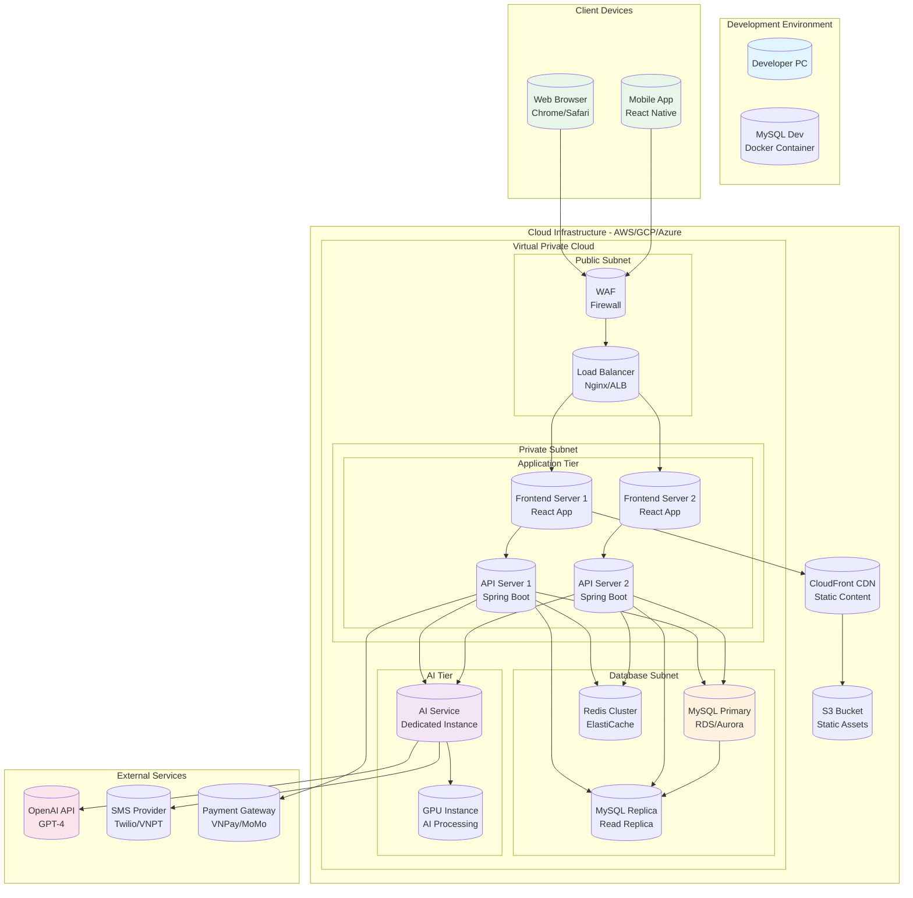

---

## 11. AI WORKFLOW DIAGRAM

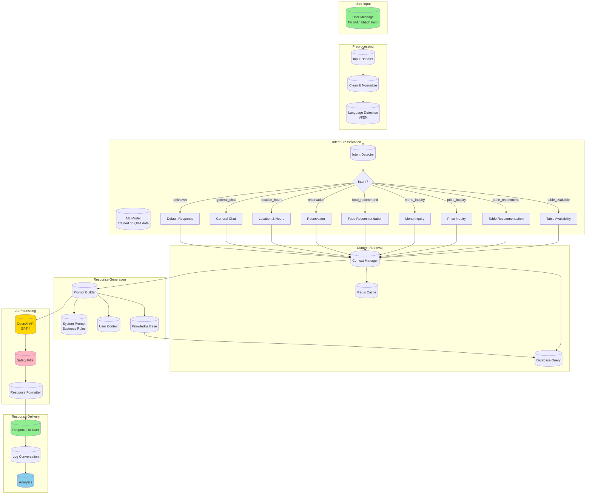

---

## 12. AI RECOMMENDATION DIAGRAM

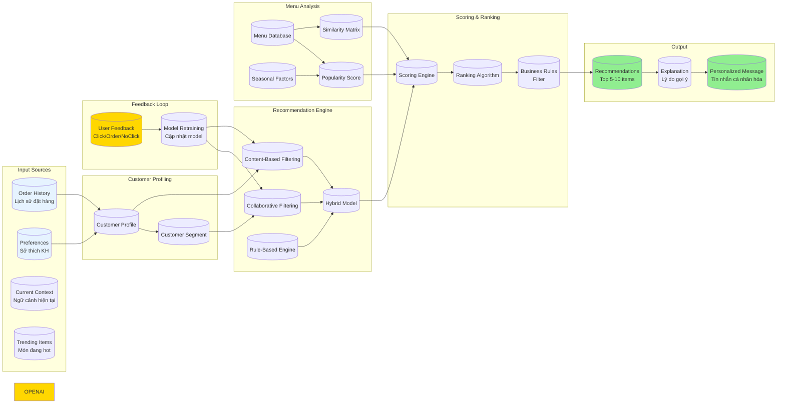

---

## USE CASE SPECIFICATION CHI TIẾT

### UC-001: Đặt bàn

| Field | Value |
|-------|-------|
| **Use Case ID** | UC-001 |
| **Use Case Name** | Đặt bàn (Reserve Table) |
| **Actor** | Khách hàng, Nhân viên |
| **Goal** | Đặt trước bàn bida cho khách hàng |
| **Priority** | High |

**Basic Flow:**
1. Khách hàng truy cập trang đặt bàn
2. Hệ thống hiển thị form đặt bàn
3. Khách hàng nhập thông tin: ngày, giờ, số người, số điện thoại
4. Hệ thống kiểm tra tính khả dụng của bàn
5. Hệ thống hiển thị các bàn phù hợp
6. Khách hàng chọn bàn
7. Hệ thống lưu thông tin đặt bàn
8. Hệ thống gửi xác nhận qua SMS/Email
9. Bàn được cập nhật trạng thái thành "reserved"

**Alternative Flow:**
- Nếu không có bàn phù hợp: Gợi ý thời gian khác
- Nếu khách hàng chưa có tài khoản: Tạo tài khoản tạm thời

**Business Rules:**
- Thời gian đặt tối thiểu: 30 phút
- Thời gian đặt tối đa: 30 ngày
- Số người tối thiểu: 1
- Số người tối đa: theo capacity của bàn

---

### UC-002: Check-in bàn

| Field | Value |
|-------|-------|
| **Use Case ID** | UC-002 |
| **Use Case Name** | Check-in bàn (Table Check-in) |
| **Actor** | Nhân viên |
| **Goal** | Bắt đầu phiên chơi cho khách |
| **Priority** | High |

**Basic Flow:**
1. Nhân viên chọn bàn cần check-in
2. Hệ thống hiển thị thông tin bàn và khách hàng (nếu có)
3. Nhân viên xác nhận thông tin khách hàng
4. Nhân viên nhấn nút "Bắt đầu"
5. Hệ thống tạo table_session mới
6. Hệ thống bắt đầu đếm thời gian
7. Bàn chuyển sang trạng thái "occupied"

**Business Rules:**
- Chỉ bàn ở trạng thái "available" mới được check-in
- Nếu có reservation, tự động load thông tin khách hàng

---

### UC-003: Check-out bàn

| Field | Value |
|-------|-------|
| **Use Case ID** | UC-003 |
| **Use Case Name** | Check-out bàn (Table Check-out) |
| **Actor** | Nhân viên |
| **Goal** | Kết thúc phiên chơi và thanh toán |
| **Priority** | High |

**Basic Flow:**
1. Nhân viên chọn bàn đang chơi
2. Hệ thống hiển thị chi tiết: thời gian chơi, tiền thuê bàn, các món đã gọi
3. Nhân viên kiểm tra thông tin
4. Nhân viên áp dụng khuyến mãi (nếu có)
5. Hệ thống tính tổng tiền
6. Khách hàng thanh toán
7. Hệ thống tạo hóa đơn
8. Hệ thống cập nhật điểm tích lũy
9. Bàn chuyển sang trạng thái "available"

**Business Rules:**
- Tiền thuê bàn = thời gian (phút) × (giá/60)
- Làm tròn lên đến 5 phút
- Tích điểm = 10% tổng hóa đơn

---

### UC-010: Gọi món

| Field | Value |
|-------|-------|
| **Use Case ID** | UC-010 |
| **Use Case Name** | Gọi món (Order Items) |
| **Actor** | Nhân viên, Khách hàng |
| **Goal** | Thêm đồ ăn, đồ uống vào hóa đơn |
| **Priority** | High |

**Basic Flow:**
1. Chọn bàn đang chơi
2. Hiển thị menu theo danh mục
3. Chọn món và số lượng
4. Xác nhận thêm món
5. Hệ thống cập nhật hóa đơn
6. In order đến bar/bếp (nếu cần)

**Business Rules:**
- Chỉ bàn ở trạng thái "occupied" mới được gọi món
- Tự động tạo order nếu chưa có

---

### UC-021: Chat tư vấn AI

| Field | Value |
|-------|-------|
| **Use Case ID** | UC-021 |
| **Use Case Name** | Chat tư vấn AI (AI Chat Consultation) |
| **Actor** | Khách hàng, AI Chatbot |
| **Goal** | Cung cấp thông tin và tư vấn cho khách hàng |
| **Priority** | High |

**Basic Flow:**
1. Khách hàng nhắn tin vào chatbot
2. Hệ thống phân tích intent của câu hỏi
3. Hệ thống lấy context từ database
4. Gọi OpenAI API với prompt đã thiết kế
5. Nhận và format câu trả lời
6. Hiển thị cho khách hàng

**Supported Intents:**
- Table availability
- Price inquiry
- Menu information
- Location and hours
- Table recommendation
- Food recommendation
- Reservation
- General questions

---

### UC-022: Gợi ý bàn AI

| Field | Value |
|-------|-------|
| **Use Case ID** | UC-022 |
| **Use Case Name** | Gợi ý bàn AI (AI Table Recommendation) |
| **Actor** | AI Recommender, Khách hàng |
| **Goal** | Đề xuất bàn phù hợp nhất cho khách |
| **Priority** | Medium |

**Basic Flow:**
1. Khách hàng hỏi về đặt bàn hoặc gợi ý
2. AI phân tích các yếu tố:
   - Số người
   - Loại bàn mong muốn (VIP, family, standard)
   - Thời gian chơi dự kiến
   - Ngân sách
3. AI truy vấn bàn trống phù hợp
4. AI xếp hạng và đề xuất top 3 bàn
5. Trả về thông tin chi tiết và cách đặt

---

### UC-023: Gợi ý món AI

| Field | Value |
|-------|-------|
| **Use Case ID** | UC-023 |
| **Use Case Name** | Gợi ý món AI (AI Food Recommendation) |
| **Actor** | AI Recommender, Khách hàng |
| **Goal** | Đề xuất món ăn, đồ uống phù hợp |
| **Priority** | Medium |

**Basic Flow:**
1. Thu thập thông tin khách hàng:
   - Món đã gọi trong phiên
   - Lịch sử order (nếu có khách quen)
   - Sở thích đã lưu
2. Phân tích context:
   - Thời gian trong ngày
   - Mùa/ngày lễ
   - Top selling items
3. AI đề xuất 5-10 món phù hợp
4. Trả về kèm giá và mô tả

**Recommendation Factors:**
- Collaborative filtering (khách tương tự đã order)
- Content-based (món tương tự đã thích)
- Popularity (món bán chạy)
- Seasonal (món theo mùa)

---

## CÔNG NGHỆ SỬ DỤNG

| Layer | Technology | Version |
|-------|------------|---------|
| **Frontend** | ReactJS | 18.x |
| **Mobile** | React Native | 0.72.x |
| **State Management** | Redux Toolkit / Zustand | Latest |
| **UI Framework** | Tailwind CSS / Material UI | Latest |
| **Backend** | Spring Boot | 3.x |
| **Security** | Spring Security + JWT | Latest |
| **Database** | MySQL | 8.0 |
| **Cache** | Redis | 7.x |
| **AI** | OpenAI API | GPT-4 |
| **File Storage** | AWS S3 / MinIO | Latest |
| **Payment** | VNPay / MoMo API | Latest |
| **SMS** | Twilio / VNPT | Latest |
| **Container** | Docker / Kubernetes | Latest |
| **CI/CD** | GitHub Actions | Latest |

---

## TIÊU CHUẨN UML

| Diagram | Tiêu chuẩn |
|---------|------------|
| Use Case | UML 2.5 - Actor, Use Case, System Boundary |
| Activity | UML 2.5 - Activity, Decision, Fork/Join |
| Sequence | UML 2.5 - Lifeline, Message, Activation |
| Class | UML 2.5 - Class, Attribute, Operation, Relationship |
| ERD | Crow's Foot Notation |
| Component | UML 2.5 - Component, Interface, Dependency |
| Deployment | UML 2.5 - Node, Artifact, Connection |
| State Machine | UML 2.5 - State, Transition |

---

*Document Version: 1.0*
*Created for: Đồ án tốt nghiệp Công nghệ Thông tin*
*Topic: Hệ thống Quản lý Billiard Cafe Tích hợp AI*
